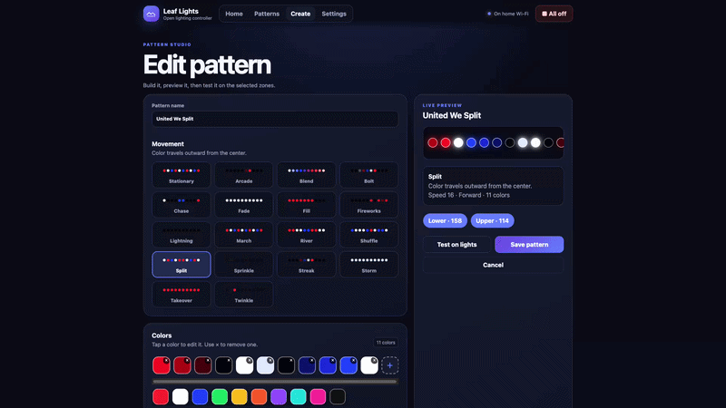
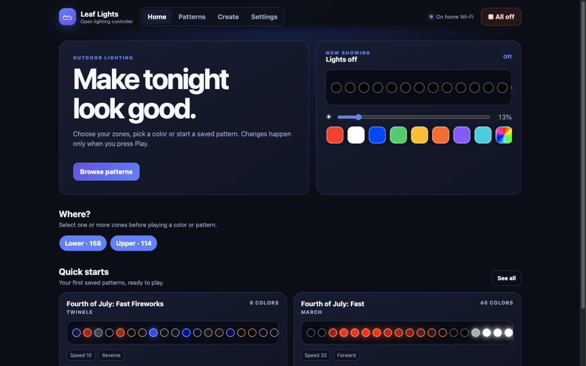
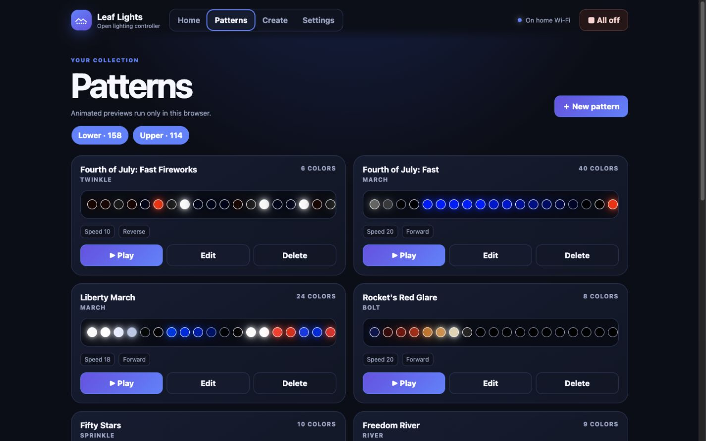
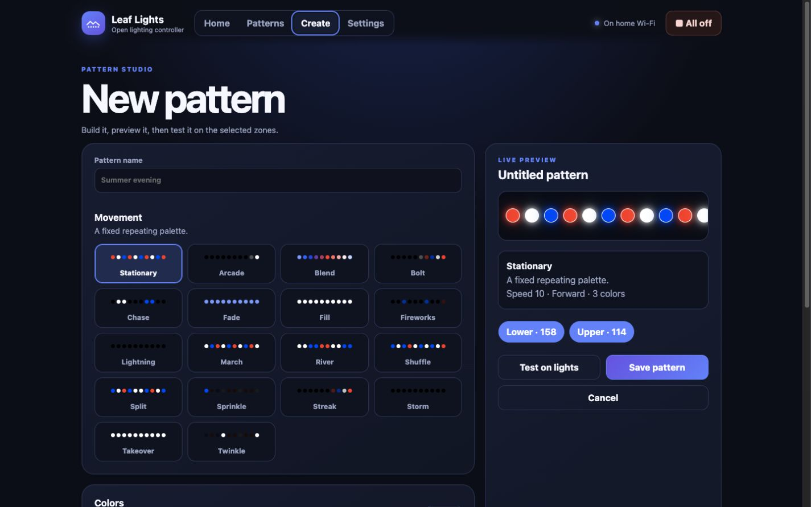
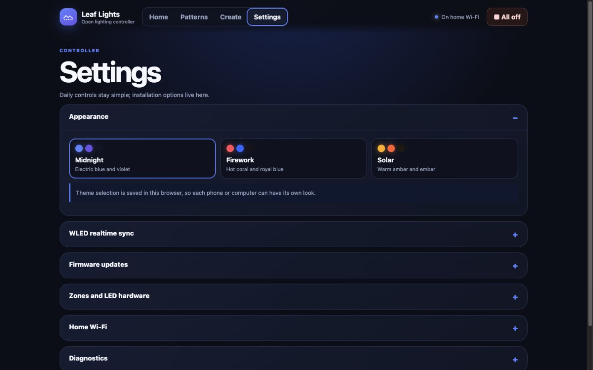
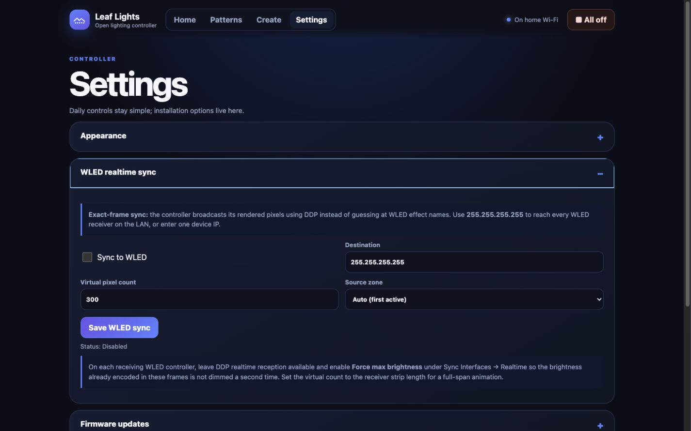

# Oelo / LeafFilter lights research and replacement controller



This repository documents the protocol used by an Oelo/Lighting by LeafFilter
controller and provides an open ESP32-S3 sample controller for existing
UCS1903 lighting installations.

The sample firmware currently runs on an Unexpected Maker TinyS3 and provides:

- six configurable UCS1903 outputs at 400 kbit/s;
- Oelo's two-physical-pixels-per-fixture mapping;
- persistent zone names, fixture counts, enable state, and color order;
- a phone-first browser interface with animated pattern previews, daily controls,
  pattern editing, three original visual themes, and advanced installation
  settings;
- compatibility with the LeafFilter app's offline Local AP Control mode;
- controller-hosted offline pattern profiles and a ten-preset Independence Day
  collection;
- non-blocking approximations of all 17 movement types exposed by the app plus
  a custom multi-burst fireworks engine;
- optional realtime DDP broadcast of rendered frames to WLED controllers;
- browser firmware updates using the ESP32's inactive OTA application slot,
  password-protected whenever the open compatibility network is active;
- GitHub release discovery, release-note review, selected-version installation,
  and opt-in automatic stable updates;
- the recovered **Fourth of July: Fast Fireworks** profile and nine original
  red, white, and blue presets.

## Current status

The following installation has been exercised on-device:

| Zone | Name | Fixtures | Color order | TinyS3 GPIO |
|---:|---|---:|---|---:|
| 1 | Lower | 158 | GBR | 1 |
| 2 | Upper | 114 | GBR | 2 |
| 3–6 | Disabled | — | GBR | 4, 5, 6, 7 |

The web server, persistent settings, Local AP API, pattern persistence, and all
17 pattern names have passed runtime smoke tests. Exact visual parity with the
vendor's animation engines is not claimed; Fast Fireworks uses the recovered
name, palette, type, direction, and speed with our non-blocking twinkle engine.

## Browser interface

These screenshots were captured from a live `v0.5.1` controller. Network
credentials, personal SSIDs, LAN addresses, MAC addresses, chip identifiers,
firmware passwords, and diagnostic data are intentionally excluded.

### Daily control

The dashboard keeps routine actions together: choose one or more zones, adjust
brightness, set a solid color, start a saved pattern, or turn every zone off.
Changes are explicit—the controller does not alter the lights until **Play** is
pressed.



### Animated pattern library

Saved profiles include an animated LED preview plus their movement, palette
size, speed, direction, and gap. Profiles can be played, edited, or deleted
without relying on the vendor cloud.



### Pattern studio

The editor exposes every recovered movement type plus the custom multi-burst
fireworks engine. It provides palette editing, animation parameters, zone
selection, a browser preview, direct testing on the lights, and persistent
saved profiles.



### Original themes

**Midnight**, **Firework**, and **Solar** replace the vendor-like green chrome.
Theme choice is stored independently in each browser, allowing different phones
or computers to use their preferred appearance.



### Exact-frame WLED synchronization

Optional DDP synchronization sends the controller's rendered pixels to one
WLED receiver or every receiver on the LAN. This preserves the Oelo palette and
motion instead of attempting to translate effects by name.



## Quick start

Requirements:

- Unexpected Maker TinyS3;
- PlatformIO;
- 5 V `74HCT244` or `74AHCT244` level shifting for installed use;
- correctly sized external LED power supply;
- common ground between the ESP32, level shifter, and lights.

Build and upload:

```sh
cd firmware/tinys3
pio run -e um_tinys3
pio run -e um_tinys3 -t upload
```

After flashing, connect to the open `OELO_1-23.0` access point and open:

```text
http://172.24.1.1
```

Select one or more zones and press **Play** on a saved pattern, or use the
LeafFilter app workflow in [docs/leaf-filter-app.md](docs/leaf-filter-app.md).
WLED receiver setup is covered in [docs/wled-sync.md](docs/wled-sync.md).

## First electrical test

Test only one data output before connecting the full installation:

```text
TinyS3 GPIO1 -> 220–470 ohm resistor -> LED DATA 1
TinyS3 GND  --------------------------> LED GND
```

A direct 3.3 V data signal is acceptable only as a short-cable experiment. The
original PCB uses a 5 V HCT244 non-inverting buffer, so a replacement should do
the same. Never power the lights from the TinyS3.

## Documentation

- [Recovered LED protocol](docs/protocol.md)
- [Original and replacement hardware](docs/hardware.md)
- [Local controller HTTP API](docs/local-api.md)
- [LeafFilter app offline workflow](docs/leaf-filter-app.md)
- [Patterns and Fast Fireworks](docs/patterns.md)
- [WLED realtime synchronization](docs/wled-sync.md)
- [GitHub releases and automatic updates](docs/releases.md)
- [Firmware update path](docs/firmware-update-path.md)
- [Research method and confidence](docs/research.md)
- [Sample firmware details](firmware/tinys3/README.md)
- [Security considerations](SECURITY.md)

## Repository boundaries

This repository contains original documentation and replacement firmware. It
does **not** redistribute the vendor APK, decompiled application, vendor
firmware binaries, flash backups, account data, credentials, or device-specific
identifiers.

Oelo and LeafFilter are trademarks of their respective owners. This project is
independent and is not affiliated with or endorsed by either company.

## License

Original code and documentation in this repository are available under the
[MIT License](LICENSE). This license does not apply to third-party products,
firmware, applications, trademarks, or protocols discussed by the project.
